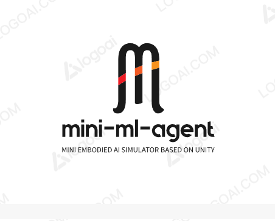

# Mini ML-Agents

**Mini-ML-Agents** is based on ml-agents-0.1.1, and will as a learning courseware to explain how to implement a agent framework based on Unity.

## Features
* Unity Engine flexibility and simplicity
* Multiple observations (cameras)
* Flexible Multi-agent support
* Discrete and continuous action spaces
* Python (2 and 3) control interface
* Visualizing network outputs in environment
* Tensorflow Sharp Agent Embedding _[Experimental]_

## Creating an Environment

The _Agents SDK_, including example environment scenes is located in
`unity-environment` folder. 

you have tow ways:

- 3DBall.exe in python path has built for window platform,you can use it to test .
- or you can build it with Unity3D(2017-1.0f3 version) as follows:
  - load the package: unity-environment
  - enter the unity editor, click menu [file/Build Settings] and select target platform:window and archtecture:x86_64 
  - click build button to generate exe file.
  

## Training your Agents

Once you've built a Unity Environment, example Reinforcement Learning
algorithms and the Python API are available in the `python`
folder. For requirements, instructions, and other information, see the
contained Readme and the relevant.
