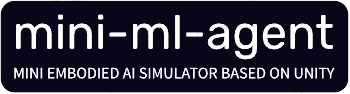

# Mini ML-Agents

**Mini-ML-Agents** is based on ml-agents-0.1.1, and will as a learning courseware to explain how to implement a agent framework based on Unity.

For a walkthrough on how to train an agent in one of the provided
example environments, start
[here](../../wiki/Getting-Started-with-Balance-Ball).

## Features
* Unity Engine flexibility and simplicity
* Multiple observations (cameras)
* Flexible Multi-agent support
* Discrete and continuous action spaces
* Python (2 and 3) control interface
* Visualizing network outputs in environment
* Tensorflow Sharp Agent Embedding _[Experimental]_

## Creating an Environment

The _Agents SDK_, including example environment scenes is located in
`unity-environment` folder. For requirements, instructions, and other
information, see the contained Readme and the relevant
[wiki page](../../wiki/Making-a-new-Unity-Environment).

## Training your Agents

Once you've built a Unity Environment, example Reinforcement Learning
algorithms and the Python API are available in the `python`
folder. For requirements, instructions, and other information, see the
contained Readme and the relevant
[wiki page](../../wiki/Unity-Agents---Python-API).
